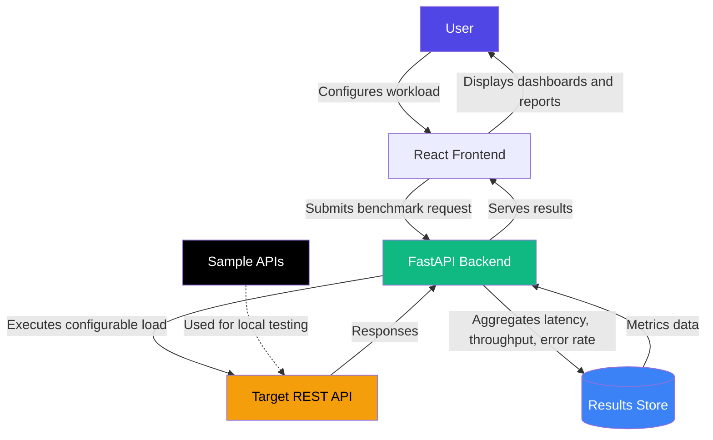

# API Benchmarking Suite

A full-stack platform for monitoring and benchmarking REST APIs under configurable workloads.

---

## Overview

API Benchmarking Suite provides a way to define, run, and analyze performance tests against REST APIs. It lets users configure workload parameters — such as request volume, concurrency, and duration — and view the resulting performance metrics through a web dashboard, making it easier to evaluate API reliability and performance under varying levels of load.

---

## Architecture



---

## Repository Structure

```
api_benchmarking_suite/
│
├── backend/
│   └── (FastAPI service: workload execution and metrics API)
│
├── frontend/
│   └── (Web dashboard for configuring and reviewing benchmarks)
│
├── sample_apis/
│   └── (Sample REST APIs for local benchmarking and testing)
│
├── LICENSE
└── README.md
```

---

## Core Concepts

- **Configurable Workloads** — Define request volume, concurrency, and duration for a benchmark run.
- **Target APIs** — Benchmark any REST API endpoint, including the bundled sample APIs for local testing without external dependencies.
- **Performance Metrics** — Capture and aggregate key indicators such as latency, throughput, and error rate across a run.
- **Monitoring Dashboard** — Review benchmark results through the frontend interface.

---

## Tech Stack

| Layer | Technologies |
|---|---|
| Backend | FastAPI |
| Frontend | React |
| Testing Targets | Bundled sample REST APIs |

---

## Local Setup

### Clone the Repository
```bash
git clone https://github.com/Harshan07-web/api_benchmarking_suite.git
cd api_benchmarking_suite
```

### Backend Setup
```bash
cd backend
pip install -r requirements.txt
uvicorn main:app --reload
```

### Frontend Setup
```bash
cd frontend
npm install
npm run dev
```

### Sample APIs (optional, for local benchmarking)
```bash
cd sample_apis
# refer to individual sample API instructions for running each service
```

---

## Usage

1. Start the backend and frontend services.
2. Open the dashboard in your browser.
3. Configure a benchmark run by specifying the target API endpoint and workload parameters (concurrency, duration, request rate).
4. Start the benchmark and monitor live or aggregated results.
5. Review latency, throughput, and error-rate metrics for the completed run.

---

## Future Improvements

- Historical comparison across benchmark runs
- Support for authenticated API endpoints
- Configurable alerting on performance thresholds
- Export of benchmark reports (CSV/PDF)
- Distributed load generation for higher-scale testing

---

## License

This project is licensed under the MIT License.

---

## Author

**Harshan**
GitHub: [@Harshan07-web](https://github.com/Harshan07-web)
